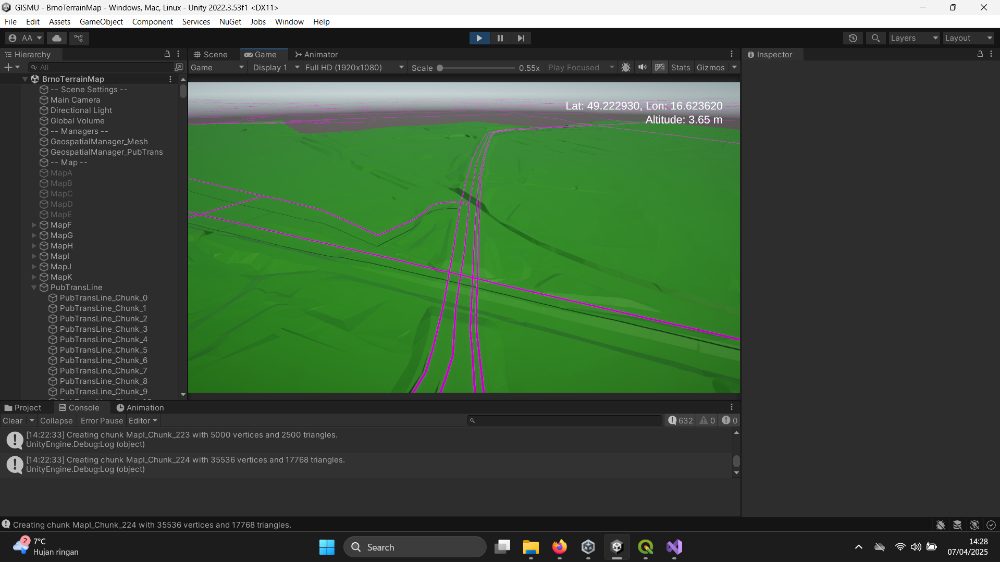

# 🛰  GISMU: Geospatial Visualization in Unity

  
*A Unity-based 3D visualization of geospatial data in Brno, CZ.*

---

## Objective

- 🔍 **Explore and Visualize Geospatial Data** and how it can be visualized effectively in Unity
- 🗺️ **Interact with Terrain Data**, allowing users to interact and experiment with spatial information
- 🥽 **(Potential) VR Support** for general-purpose geospatial data projects and immersive exploration

## Features

- 📁 **Shapefile Support**: Parses and displays both Polygon and LineString geometries
- 🗻 **Terrain Reconstruction**: Uses elevation data from Brno’s 2019 digital terrain model (DTM)
- ⚙️ **Modular Architecture**: Designed for extension to new datasets or interaction methods

## Datasets Used

1. **[Digital Terrain Model of Brno (2019)](https://data.brno.cz/datasets/mestobrno::digit%C3%A1ln%C3%AD-model-ter%C3%A9nu-brna-2019-brno-digital-terrain-model-2019/about)**  
   Used to generate terrain mesh and elevation data.

2. **[Public Transport Lines - Bus](https://data.brno.cz/datasets/mestobrno::intenzity-mhd-autobus-public-transport-intensity-bus/about)**  
   Used to visualize transportation lines (Bus) over Brno.

3. **[Sidewalks](https://data.brno.cz/datasets/mestobrno::chodn%C3%ADky-sidewalks/about)**  
   Used to visualize sidewalks over Brno.

4. **[Trees & Bushes](https://data.brno.cz/datasets/mestobrno::stromy-kere/about)**  
   Used to visualize trees and bushes points over Brno.

5. **[Streetlights](https://data.brno.cz/datasets/mestobrno::sto%C5%BE%C3%A1ry-ve%C5%99ejn%C3%A9ho-osv%C4%9Btlen%C3%AD-street-lights/about)**  
   Used to visualize streetlight points over Brno.

## Getting Started

1. Clone the repository:
   ```bash
   git clone https://github.com/your-username/brno-geodata-visualizer.git
   ```

2. Download the Dataset (used for Demo) to `Data` folder.
3. Start the Project in Unity (URP)

# Running the Build (Brno Visualization)

1. Execute the `GISMU.exe`
2. On setup, it might take a while. Up to 5 minutes to load the whole map of Brno.
3. On run time, attachments (Transportation Lines, Sidewalks, Trees & Bushes, and Streetlights) are being processed step by step. Runtime load (under 5 minutes).
4. Use the right mouse button to lock in the cursor (hidden), to exit use the Escape key to show the cursor.
